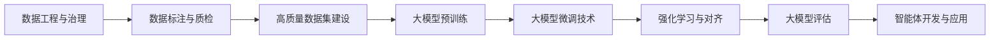

# CGN领域大模型训练与评估研究

**CGN LLM Training & Evaluation Research**

本仓库系统性收集了关于**多源异构数据融合、数据工程、大模型训练、评估方法论及智能体应用**的技术资料和研究文献。

## 🎯 项目目标

1. 研究多源异构数据资产治理方案，建设高质量数据集
2. 构建垂直领域大模型，提升专业任务性能
3. 开发智能体应用，实现业务流程自动化

## 📁 目录结构

```
cgn-llm-training-research/
├── README.md                    # 项目总览
├── researches/                  # 研究资料目录
│   ├── 数据工程与治理/
│   │   ├── README.md        # 主题资料索引
│   │   └── images/          # 图片资源
│   ├── 数据标注与质检/
│   │   ├── README.md        # 主题资料索引
│   │   └── images/          # 图片资源
│   ├── 大模型预训练/
│   │   ├── README.md        # 主题资料索引
│   │   └── images/          # 图片资源
│   ├── 大模型微调技术/
│   │   ├── README.md        # 主题资料索引
│   │   └── images/          # 图片资源
│   ├── 强化学习与对齐/
│   │   ├── README.md        # 主题资料索引
│   │   └── images/          # 图片资源
│   ├── 大模型评估/
│   │   ├── README.md        # 主题资料索引
│   │   └── images/          # 图片资源
│   ├── 智能体开发与应用/
│   │   ├── README.md        # 主题资料索引
│   │   └── images/          # 图片资源
├── collected_urls.json          # 完整资料链接库
└── selected_urls.json           # 精选资料链接
```

## 🔬 研究主题

### 1. [数据工程与治理](./researches/数据工程与治理/README.md)

多源异构数据融合、数据资产治理、数据质量管理

📚 精选资料: 5 篇

### 2. [数据标注与质检](./researches/数据标注与质检/README.md)

AI数据标注标准、质量控制、自动化工具

📚 精选资料: 5 篇

### 3. [大模型预训练](./researches/大模型预训练/README.md)

领域预训练、继续预训练、算力优化

📚 精选资料: 5 篇

### 4. [大模型微调技术](./researches/大模型微调技术/README.md)

LoRA、PEFT、SFT、指令微调

📚 精选资料: 5 篇

### 5. [强化学习与对齐](./researches/强化学习与对齐/README.md)

RLHF、DPO、人类偏好对齐

📚 精选资料: 5 篇

### 6. [大模型评估](./researches/大模型评估/README.md)

评估指标、基准测试、评估框架

📚 精选资料: 5 篇

### 7. [智能体开发与应用](./researches/智能体开发与应用/README.md)

Agent架构、RAG技术、工程化实践

📚 精选资料: 5 篇

## 📊 统计信息

- **研究主题**: 7 个
- **精选资料**: 35 篇
- **资料类型**: 技术博客、学术论文、官方文档、开源项目
- **更新时间**: 2025-12-01 21:42:19

## 🚀 快速开始

### 浏览资料

1. 进入 `researches/` 目录
2. 选择感兴趣的主题文件夹
3. 阅读 `README.md` 了解该主题的资料索引
4. 点击链接在线阅读原文

### 学习路径建议



## 🔗 相关资源

### 开源工具

- [BasicWebCrawler](https://github.com/DemonDamon/BasicWebCrawler) - 网页爬虫工具
- [TableParser](https://github.com/DemonDamon/TableParser) - 表格解析工具

### 项目特色

- 系统性的知识体系构建
- 高质量的技术资料精选
- 结构化的学习路径设计

## 📝 使用说明

### 资料组织

每个主题目录包含：

- **README.md**: 该主题的资料索引和学习指南
- **images/**: 用于存放相关图片资源
- 资料以链接形式提供，点击可在线阅读

### 资料类型

- 📦 **开源项目**: GitHub上的开源实现
- 📄 **学术论文**: arXiv、IEEE等学术文献
- 📘 **官方文档**: AWS、Microsoft、IBM等官方技术文档
- ✍️ **技术博客**: 知乎、CSDN等平台的技术文章
- 🤗 **HuggingFace**: HuggingFace平台的教程和资源

## 🤝 贡献指南

欢迎贡献高质量的学习资源！

1. Fork 本仓库
2. 在对应主题的 README.md 中添加资料链接
3. 提交 Pull Request

## ⚠️ 免责声明

本仓库资料来源于公开网络，仅供学习研究使用。所有资料版权归原作者所有。

- 如有侵权，请联系删除
- 资料内容仅代表原作者观点
- 使用资料请遵守相关法律法规

## 📧 联系方式

如有问题或建议，欢迎通过 GitHub Issues 反馈。

---

**最后更新**: 2025-12-01

**维护者**: DemonDamon
