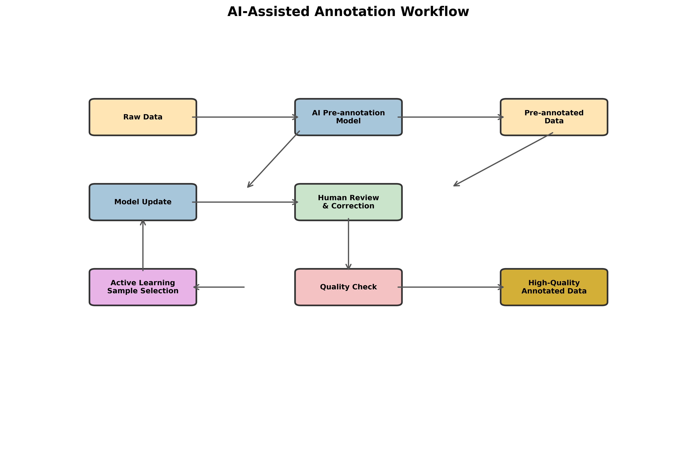
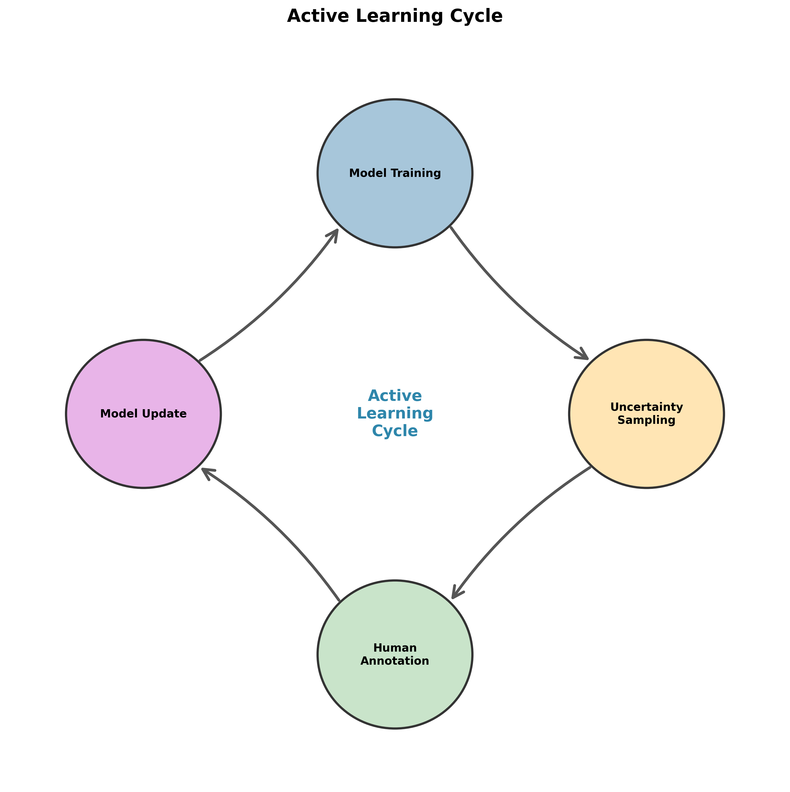

# 基于人工智能技术的数据集标注标准

---

**版本**: 1.0  
**日期**: 2025-12-02  

---

## 1. 概述

### 1.1. 背景

数据标注是连接原始数据与机器学习模型的桥梁，其质量直接决定了模型的学习效果和最终性能。传统的人工标注方法不仅成本高、效率低，而且难以保证大规模数据的一致性和准确性。引入人工智能（AI）技术，特别是**AI辅助标注**和**主动学习**，可以显著提升标注效率和质量，降低标注成本。

### 1.2. 目标

本标准旨在建立一套基于AI技术的数据集标注流程和规范，确保标注工作的高效率、高质量和高一致性。具体目标包括：

- **定义各类数据的标注规范**：为文本、图像、代码等不同类型的数据提供清晰的标注指南。
- **建立人机协同的标注流程**：融合AI预标注和人工审核，实现高效的人机协同。
- **实施多层次的质量控制体系**：通过自动化质检和人工抽检，保障标注数据的准确性。
- **推广主动学习策略**：优先标注对模型提升最显著的数据，最大化标注工作的投资回报率。

### 1.3. 适用范围

本标准适用于领域大模型训练所需的所有数据标注任务，包括但不限于：

- **文本标注**：实体识别、关系抽取、文本分类、情感分析、摘要生成、指令微调等。
- **图像标注**：目标检测、图像分割、关键点检测、图像描述等。
- **代码标注**：代码意图理解、代码注释生成、代码缺陷检测等。

---

## 2. AI辅助标注流程

AI辅助标注的核心思想是利用预训练模型对数据进行自动标注，然后由人工进行审核和修正。这一流程将人的角色从“从零开始标注”转变为“审核和修正”，大大提升了效率。

*图1：AI辅助标注流程* 

### 2.1. 预标注模型选择

根据不同的数据类型和标注任务，选择合适的预训练模型进行预标注。

| 数据类型 | 标注任务 | 推荐预训练模型 |
|---|---|---|
| **文本** | 实体识别、文本分类 | BERT、RoBERTa、GPT系列 |
| **图像** | 目标检测、图像分割 | YOLO、Faster R-CNN、Segment Anything Model (SAM) |
| **代码** | 代码意图理解 | CodeBERT、CodeGen、StarCoder |

### 2.2. 人工审核与修正

人工审核是保证标注质量的关键环节。审核人员需要重点关注：

- **预标注的准确性**：修正模型标注错误的标签和边界。
- **标注的一致性**：确保同一实体或概念在不同数据中的标注保持一致。
- **边界案例的处理**：对于模型难以判断的模糊案例，由人工进行决策和标注。

### 2.3. 主动学习与模型迭代

通过主动学习策略，可以智能地选择最有价值的数据进行标注，从而用更少的标注数据达到更好的模型性能。

**主动学习循环**：
1. **模型训练**：使用已标注的数据训练一个初始模型。
2. **不确定性采样**：模型对未标注数据进行预测，并计算每个样本的不确定性得分。
3. **数据选择**：选择不确定性得分最高的样本，交由人工进行标注。
4. **模型更新**：将新标注的数据加入训练集，重新训练和更新模型。

*图2：主动学习循环* 

---

## 3. 具体数据类型标注标准

### 3.1. 文本标注标准

#### 3.1.1. 实体识别 (NER)

- **实体类型定义**：清晰定义每种实体类型的内涵和外延，并提供典型示例。
- **标注粒度**：遵循“最短最完整”原则，标注能够独立表达完整语义的最小单元。
- **嵌套实体**：对于存在嵌套关系的实体，应根据业务需求决定是否进行嵌套标注。

#### 3.1.2. 指令微调 (Instruction Tuning)

- **指令多样性**：指令应覆盖多种意图，如问答、生成、改写、摘要等。
- **高质量回答**：回答应准确、完整、无害，并符合指令的要求。
- **“零样本”和“少样本”**：构建包含“零样本”和“少样本”示例的指令数据，提升模型的泛化能力。

### 3.2. 图像标注标准

#### 3.2.1. 目标检测

- **边界框紧密性**：边界框应紧密包围目标物体，不包含过多背景。
- **遮挡处理**：对于被遮挡的物体，应根据可见部分进行标注，并添加“遮挡”属性。
- **小目标处理**：对于尺寸过小的目标，应根据业务需求决定是否进行标注。

#### 3.2.2. 图像分割

- **边缘精确性**：分割掩码的边缘应与目标物体的实际边缘高度贴合。
- **类别一致性**：确保同一类别的物体使用相同的颜色或标签进行标注。

---

## 4. 质量控制体系

### 4.1. 质量评估指标

| 指标 | 计算公式 | 说明 |
|---|---|---|
| **准确率 (Accuracy)** | (TP + TN) / (TP + TN + FP + FN) | 衡量标注结果的正确性 |
| **一致性 (Consistency)** | Inter-Annotator Agreement (IAA) | 衡量不同标注员之间的一致性，常用Fleiss' Kappa系数 |
| **完整性 (Completeness)** | 标注实体数 / 应标注实体数 | 衡量是否存在漏标 |

### 4.2. 质检流程

- **一级质检（自检）**：标注员完成标注后，自行检查一遍。
- **二级质检（交叉互检）**：由其他标注员对标注结果进行检查。
- **三级质检（专家抽检）**：由领域专家对疑难和重要数据进行最终审核。

### 4.3. 自动化质检

利用AI技术可以实现部分质检工作的自动化：

- **规则校验**：检查标注结果是否符合预定义的规则（如：实体长度、标签依赖关系）。
- **异常检测**：识别与大多数样本显著不同的异常标注。
- **一致性检查**：自动计算不同标注员之间的一致性得分。

---

## 5. 工具与平台

- **推荐标注平台**: **Label Studio**
  - **优点**: 开源、灵活、支持多种数据类型、支持AI辅助标注。
  - **集成**: 可与各类预训练模型轻松集成，实现高效的人机协同标注流程。

- **其他备选工具**: CVAT, SuperAnnotate, Labelbox

---

## 6. 附录

### 6.1. 参考文献

[1] Settles, B. "Active Learning Literature Survey." University of Wisconsin-Madison, 2009.
[2] Label Studio. "AI-Assisted Data Labeling." https://labelstud.io/guide/ml_backend.html
[3] Ouyang, L., et al. "Training language models to follow instructions with human feedback." arXiv preprint arXiv:2203.02155, 2022.

### 6.2. Fleiss' Kappa系数

Fleiss' Kappa是一个用于评估多个评分者之间一致性的统计量。其取值范围为-1到1，值越接近1表示一致性越高。

- **< 0**: 一致性差
- **0 - 0.2**: 轻微一致
- **0.2 - 0.4**: 一般一致
- **0.4 - 0.6**: 中度一致
- **0.6 - 0.8**: 高度一致
- **0.8 - 1.0**: 几乎完全一致
