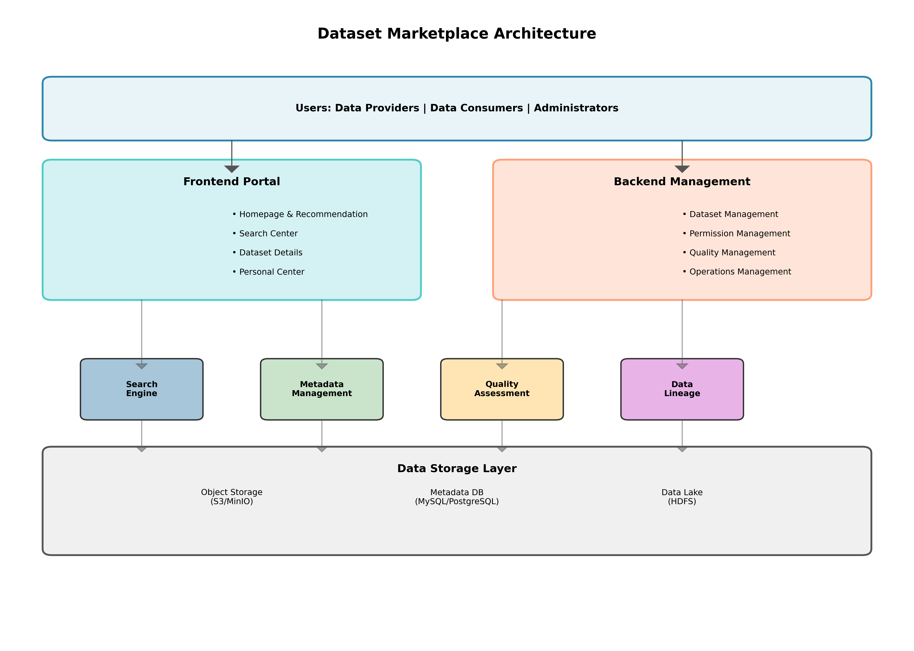

# 数据集商城（超市）规划建议方案

---

**版本**: 1.0  
**日期**: 2025-12-02  

---

## 1. 摘要

随着CGN领域大模型建设的深入，数据集作为核心战略资产，其管理、发现、复用和价值衡量变得日益重要。传统的数据管理方式已无法满足大规模、多样化、高质量数据集的敏捷应用需求。本方案提出构建一个集**数据发现、数据理解、数据获取、数据共享、价值评估**于一体的“数据集商城（超市）”平台，旨在打破数据孤岛，提升数据复用率，加速AI应用的创新和落地。

## 2. 愿景与目标

### 2.1. 平台愿景

**让数据像商品一样轻松获取，让价值像价格一样清晰可见。**

我们致力于将数据集商城打造成为CGN内部数据资产的核心枢纽和价值引擎，成为所有AI研究员、算法工程师和业务分析师寻找和使用数据的首选平台。

### 2.2. 核心目标

- **提升数据发现效率**：实现数据集的“一站式”搜索与浏览，将找数据的时间从“天”缩短到“分钟”。
- **促进数据资产复用**：通过清晰的元数据、数据血缘和使用案例，提升高质量数据集的复用率，避免重复“造轮子”。
- **保障数据合规与安全**：建立统一的数据权限申请与审批流程，确保数据在安全、合规的前提下高效流转。
- **量化数据资产价值**：通过数据质量评分、使用热度、业务贡献等维度，建立数据价值评估模型，使数据价值可量化、可衡量。

## 3. 平台功能架构

数据集商城的核心功能架构围绕“人、货、场”三个要素进行设计。

- **人**：数据提供者、数据消费者、数据管理员
- **货**：数据集本身及其衍生资产（元数据、数据质量报告、API等）
- **场**：数据集商城平台

*图1：数据集商城功能架构图*

### 3.1. 前台门户：面向数据消费者

| 模块 | 功能描述 |
|---|---|
| **首页** | - **智能推荐**：基于用户画像和行为，推荐可能感兴趣的数据集。
| | - **热门排行**：展示下载量、评分最高、最新上架的数据集榜单。
| | - **主题分类**：按业务领域（如核电、新能源）、数据类型、应用场景等进行分类导航。 |
| **搜索中心** | - **统一搜索**：支持关键词、标签、元数据等多维度混合搜索。
| | - **智能联想**：提供搜索词智能提示和纠错。
| | - **高级筛选**：支持按数据质量分、更新时间、文件格式等条件进行高级筛选。 |
| **数据集详情页** | - **数据概览**：数据集简介、大小、格式、更新时间等基本信息。
| | - **数据字典**：详细的字段级元数据描述、数据类型、业务含义。
| | - **数据质量报告**：展示由《高质量数据集评价体系》生成的多维度质量评分和报告。
| | - **数据血缘**：可视化展示数据的来源、处理过程和下游应用。
| | - **数据预览**：提供部分样本数据的在线预览功能（需进行脱敏处理）。
| | - **用户评论与评分**：展示其他用户的使用评价和打分。 |
| **个人中心** | - **我的数据**：管理已申请、已授权的数据集。
| | - **我的申请**：跟踪数据权限申请的审批进度。
| | - **我的收藏**：收藏感兴趣的数据集，方便后续查找。 |

### 3.2. 后台管理：面向数据提供者与管理员

| 模块 | 功能描述 |
|---|---|
| **数据集管理** | - **数据接入**：支持多种方式（API、手动上传、数据库同步）将数据集注册到商城。
| | - **元数据编辑**：提供友好的界面，引导数据提供者完善数据集的元数据信息。
| | - **版本控制**：管理数据集的多个版本，支持版本发布、回滚和废弃。 |
| **权限管理** | - **审批流程配置**：支持自定义多级审批流程，满足不同敏感等级数据的审批需求。
| | - **权限申请处理**：数据管理员在线处理用户的权限申请。
| | - **访问日志审计**：记录所有数据访问行为，确保可追溯、可审计。 |
| **质量管理** | - **质量任务调度**：集成《高质量数据集评价体系》，自动或手动触发数据质量评估任务。
| | - **质量报告管理**：管理和发布数据质量报告。 |
| **运营管理** | - **用户行为分析**：统计分析平台用户行为，如搜索热词、数据集浏览/下载量等。
| | - **内容管理**：配置首页推荐、分类导航等运营内容。 |

## 4. 技术方案建议

- **前端框架**：React / Vue.js，提供现代化的用户体验。
- **后端框架**：Spring Boot / Django，提供稳定可靠的API服务。
- **搜索引擎**：Elasticsearch，提供强大的全文检索和聚合分析能力。
- **元数据存储**：MySQL / PostgreSQL，存储结构化的元数据信息。
- **数据存储**：与现有的对象存储（如MinIO）或数据湖（HDFS）集成。
- **数据血缘与治理**：集成开源工具如Apache Atlas或DataHub。
- **数据质量评估**：自研或集成数据质量工具，实现自动化评估。

## 5. 实施路线图

建议分三期进行建设：

- **一期（MVP版本，3-4个月）**：
  - **核心功能**：实现数据集的注册、搜索、详情查看和权限申请审批的核心流程。
  - **目标**：打通数据“找得到、看得懂、拿得到”的基本链路，上线少量高质量数据集进行试点运营。

- **二期（功能完善，4-6个月）**：
  - **核心功能**：完善数据质量评估、数据血缘、智能推荐、个人中心等功能。
  - **目标**：提升用户体验和运营效率，扩大数据集覆盖范围，推广平台在核心业务团队的使用。

- **三期（生态构建，长期）**：
  - **核心功能**：构建数据价值评估模型、开放API生态、探索数据服务化和应用市场。
  - **目标**：将数据集商城打造为数据资产价值实现的核心平台，赋能全集团的数字化转型。

## 6. 成功关键因素

- **高层支持**：获得管理层的持续支持和资源投入，将数据集商城作为公司级战略项目进行推进。
- **制度建设**：建立配套的数据管理制度，明确数据提供者和消费者的权利与义务。
- **持续运营**：组建专门的运营团队，负责平台的推广、用户培训、内容更新和社区建设。
- **敏捷迭代**：采用敏捷开发模式，快速响应用户反馈，持续迭代和优化平台功能。
