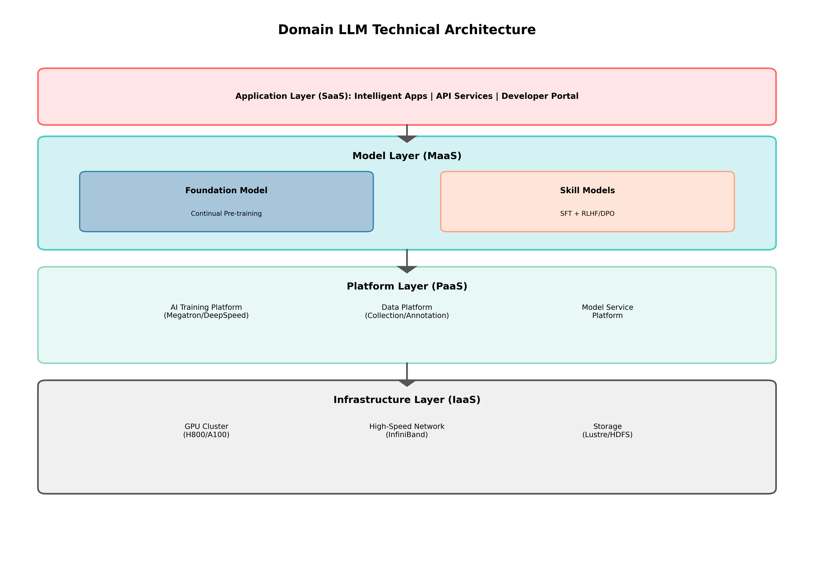

# CGN领域大模型（L3）建设方案

---

**版本**: 1.0  
**日期**: 2025-12-02  
**作者**: Manus AI

---

## 1. 项目概述

### 1.1. 背景与挑战

通用大语言模型（如GPT-4）在自然语言处理任务上取得了革命性突破，但在特定专业领域（如核电、新能源），其知识深度、专业术语理解、安全合规性等方面仍存在明显不足。为了将大模型技术真正应用于CGN的核心业务，赋能生产、运营和管理，亟需构建一个深度融合领域知识、满足行业特定需求的**CGN领域大模型**。

**核心挑战**：
- **知识壁垒**：领域知识专业性强、更新快，通用模型难以覆盖。
- **数据安全**：核心业务数据高度敏感，无法使用公共云服务进行训练。
- **任务适配**：通用模型的能力与领域特定任务（如缺陷报告分析、操作规程生成）存在差距。
- **成本可控**：从零开始训练千亿级大模型的成本极高，需要探索更经济高效的技术路径。

### 1.2. 项目目标

本项目旨在构建一个**L3级别**的CGN领域大模型，使其成为赋能集团数字化转型的“智能底座”。L3级别定义为：

> **L3 - 领域专家级模型**：在特定领域内具备深厚的专业知识和推理能力，能够理解复杂的领域任务，并生成准确、可靠、专业的解决方案，其表现在特定任务上可媲美或超越初级领域专家。

**具体目标**：
1.  **构建一个千亿参数级别的领域基础模型**：通过在通用基础模型之上进行领域知识的持续预训练，打造模型的技术底座。
2.  **实现对核心业务场景的深度适配**：通过指令微调（SFT）和人类反馈强化学习（RLHF），使模型掌握关键业务任务的处理能力。
3.  **建立一套完整的模型训练、评估和部署体系**：确保模型的可持续迭代、性能的可度量和应用的安全可控。
4.  **打造2-3个标杆性智能应用**：在智能运维、知识问答、代码生成等领域打造示范应用，验证模型价值。

## 2. 技术架构

CGN领域大模型的建设将采用“**1个基础模型 + N个技能模型**”的技术架构，以实现能力的可扩展和成本的可控。

*图1：领域大模型技术架构图*

### 2.1. 基础设施层（IaaS）

- **计算资源**：构建大规模GPU集群（如NVIDIA H800），满足千亿级模型的训练和推理需求。
- **网络资源**：采用高速、低延迟的InfiniBand网络，保障多机多卡训练的通信效率。
- **存储资源**：建设高性能并行文件系统（如Lustre），支撑海量训练数据的快速读取。

### 2.2. 平台层（PaaS）

- **AI训练平台**：提供模型开发、分布式训练、资源调度、任务监控等一站式能力。推荐采用开源框架如**Megatron-LM**或**DeepSpeed**进行深度定制。
- **数据平台**：即《高质量数据集建设方案》中规划的数据体系，提供数据采集、清洗、标注、版本管理等全生命周期支持。

### 2.3. 模型层（MaaS）

- **基础模型（Foundation Model）**：
  - **选型**：选择一个性能优异、开源友好、技术成熟的通用大模型作为基础（如Llama 3、Qwen 2）。
  - **持续预训练（Continual Pre-training）**：使用CGN积累的海量领域文本和代码数据，对基础模型进行持续预训练，将领域知识“注入”模型。
- **技能模型（Skill Models）**：
  - **指令微调（SFT）**：针对特定任务（如智能问答、报告生成），构建高质量指令微调数据集，训练模型掌握任务执行能力。
  - **强化学习（RLHF/DPO）**：构建偏好数据集，通过RLHF或直接偏好优化（DPO）等技术，使模型的输出更符合人类的偏好和价值观。

### 2.4. 应用层（SaaS）

- **模型服务平台**：将训练好的模型封装成标准的API服务，提供给上层应用调用。支持高并发、低延迟的推理服务。
- **智能应用**：基于模型API，开发面向最终用户的智能应用，如智能知识库、代码助手、虚拟专家等。

## 3. 实施路线图

项目分为三个阶段实施：

- **第一阶段：基础能力建设（6-9个月）**
  - **任务**：完成GPU集群等基础设施建设；搭建AI训练平台和数据平台；选择并验证基础模型；完成第一阶段的领域数据收集和预处理。
  - **里程碑**：完成一个70B规模基础模型的持续预训练，使其初步具备领域知识。

- **第二阶段：核心能力突破（9-12个月）**
  - **任务**：构建高质量的指令微调和偏好数据集；完成模型的SFT和RLHF训练；建立模型评测体系；开发模型服务平台。
  - **里程碑**：发布L3级别的CGN领域大模型v1.0版本；在1-2个场景中进行小范围应用验证。

- **第三阶段：规模化应用与迭代（长期）**
  - **任务**：持续优化模型性能；扩展模型在更多业务场景的应用；构建开发者社区和应用生态。
  - **里程碑**：领域大模型在集团内部得到广泛应用，成为数字化转型的重要引擎；发布v2.0、v3.0版本。

## 4. 投资估算与团队建设

### 4.1. 投资估算（初步）

| 项目 | 估算（人民币） | 备注 |
|---|---|---|
| **硬件成本** | XX亿元 | GPU服务器、网络设备、存储设备等 |
| **软件与服务** | XX千万元 | 训练平台软件、第三方数据服务、技术咨询等 |
| **人力成本** | XX千万元/年 | 算法、工程、数据、产品等团队薪酬 |
| **总计** | **XX亿元** | 初步估算，具体数值需详细论证 |

### 4.2. 团队建设

成功建设领域大模型需要一个跨学科的专业团队：

- **算法团队**：负责模型选型、算法研究、训练策略优化。
- **工程团队**：负责AI平台开发、分布式训练优化、模型部署与推理优化。
- **数据团队**：负责数据集建设、数据治理、数据标注与质量控制。
- **产品与应用团队**：负责业务需求分析、应用场景设计、产品开发与运营。

## 5. 风险与对策

- **技术风险**：大模型训练存在不确定性，可能遇到收敛困难、性能不达预期等问题。
  - **对策**：与顶尖科研机构合作；组建强大的算法团队；采用成熟的开源框架；进行充分的技术验证。
- **数据风险**：数据质量和规模不足，可能成为模型性能的瓶颈。
  - **对策**：严格执行《高质量数据集建设方案》；建立数据生态合作，引入外部高质量数据源。
- **人才风险**：大模型领域高端人才稀缺，招聘和留住人才困难。
  - **对策**：提供有竞争力的薪酬待遇和事业平台；加强内部人才培养；营造开放、创新的研究氛围。
- **应用风险**：模型能力与业务场景结合不紧密，导致“技术很先进，应用不落地”。
  - **对策**：项目初期就让业务团队深度参与；采用敏捷开发模式，快速迭代应用；建立清晰的价值评估体系来衡量模型的业务价值。
