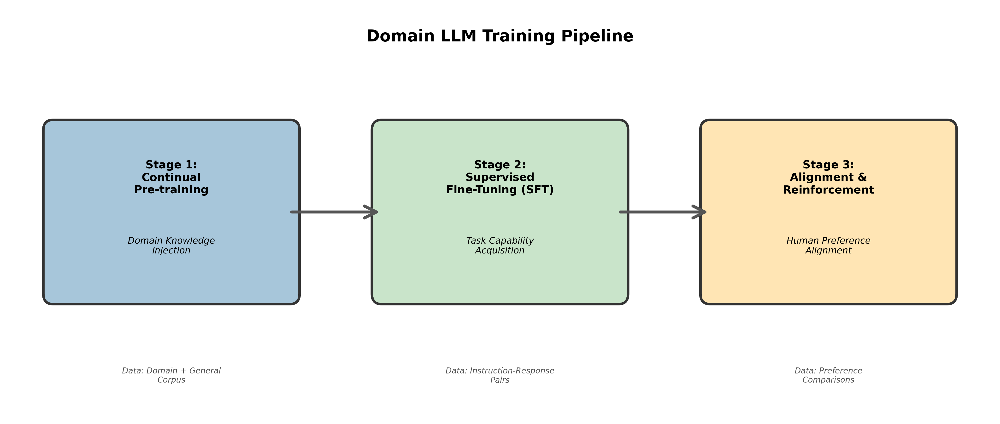

# 领域大模型训练指南

---

**版本**: 1.0  
**日期**: 2025-12-02  
**作者**: Manus AI

---

## 1. 引言

本指南旨在为CGN领域大模型的训练提供一套系统化、标准化的操作流程和最佳实践。训练一个高性能的领域大模型是一项复杂的系统工程，涉及数据、算法、工程等多个方面。遵循本指南将有助于提升训练效率、保障模型质量、降低训练风险。

本指南主要面向参与大模型训练的算法工程师和研究员，内容覆盖从数据准备到模型评估的全过程。

## 2. 训练全景图

领域大模型的训练过程主要分为三个核心阶段：

1.  **持续预训练 (Continual Pre-training)**：将通用知识与领域知识相融合，提升模型在特定领域的知识储备和理解能力。
2.  **指令微调 (Supervised Fine-Tuning, SFT)**：教会模型理解和遵循人类指令，使其具备执行特定任务的能力。
3.  **对齐与强化 (Alignment & Reinforcement)**：使模型的输出更符合人类的偏好、价值观和安全要求。

*图1：领域大模型训练三阶段流程图*

## 3. 第一阶段：持续预训练 (Continual Pre-training)

### 3.1. 目标

在通用基础模型（如Llama 3）的基础上，利用CGN海量的领域数据，向模型中“注入”核电、新能源等领域的专业知识，使其成为一个“懂行”的领域基础模型。

### 3.2. 数据准备

- **数据构成**：
  - **领域数据 (80%)**：CGN内部积累的技术文档、研究报告、操作规程、维修记录、法律法规等。
  - **通用数据 (20%)**：高质量的通用语料，如维基百科、开源书籍、技术博客等，用于防止模型“灾难性遗忘”通用知识。
- **数据质量**：
  - 严格按照《高质量数据集建设方案》进行数据清洗、去重和脱敏。
  - 确保数据的高质量是本阶段成功的关键。

### 3.3. 训练策略

- **学习率 (Learning Rate)**：建议使用较小的学习率（如1e-5至5e-6），以避免破坏基础模型已经学到的通用能力。
- **训练轮次 (Epochs)**：通常进行1-2个Epoch即可，过多的轮次可能导致过拟合。
- **数据混合策略**：在训练过程中，将领域数据和通用数据以一定比例混合输入，确保模型在学习领域知识的同时，保持通用能力。
- **词表扩展 (Vocabulary Expansion)**：如果领域数据中包含大量专业术语，可以考虑对基础模型的词表进行扩展，将高频专业术语加入词表，有助于提升模型对领域知识的编码效率。

## 4. 第二阶段：指令微调 (SFT)

### 4.1. 目标

通过在高质量的“指令-回答”数据对上进行有监督学习，教会模型理解人类的指令，并根据指令完成特定任务，如问答、生成、摘要、翻译等。

### 4.2. 数据准备

- **数据来源**：
  - **人工构建**：由领域专家结合业务场景，设计高质量的指令和对应的标准答案。
  - **用户数据挖掘**：从实际业务系统的用户查询和专家回复中，挖掘和构造指令数据。
  - **模型生成辅助**：利用强大的通用大模型（如GPT-4）辅助生成多样化的指令，再由人工进行筛选和修订。
- **数据质量**：
  - **指令多样性**：覆盖尽可能多的任务类型和表达方式。
  - **回答准确性**：答案必须准确、专业、无害。
  - **格式规范**：遵循统一的JSON格式，如`{"instruction": "...", "input": "...", "output": "..."}`。

### 4.3. 训练策略

- **模型选择**：在完成持续预训练的领域基础模型上进行微调。
- **高效微调技术 (PEFT)**：为了节省计算资源和训练时间，强烈建议采用参数高效微调技术，如**LoRA (Low-Rank Adaptation)**。
  - **LoRA优点**：仅训练少量（约0.1%-1%）的额外参数，即可达到接近全量微调的效果，同时大大降低了硬件门槛。
- **超参数设置**：
  - **学习率**：可以适当调高（如1e-4至3e-4）。
  - **LoRA秩 (r)**：通常设置为8, 16, 32或64。
  - **训练轮次**：通常进行3-5个Epoch。

## 5. 第三阶段：对齐与强化

### 5.1. 目标

SFT阶段的模型学会了“能做什么”，但不知道什么是“做得更好”。对齐阶段的目标是让模型的输出更符合人类的偏好，使其更**有用 (Helpful)**、**诚实 (Honest)** 和 **无害 (Harmless)**。

### 5.2. 主流技术路径

#### 5.2.1. 基于人类反馈的强化学习 (RLHF)

RLHF是业界最主流的对齐技术，分为三个步骤：

1.  **训练奖励模型 (Reward Model, RM)**：
    - **数据**：构建人类偏好数据集。针对同一个指令，由SFT模型生成多个不同的回答，然后由标注人员对这些回答进行排序（哪个最好，哪个次之，哪个最差）。
    - **训练**：用这个排序数据集训练一个奖励模型，该模型能够对任意“指令-回答”对打分，分数高低代表符合人类偏好的程度。
2.  **强化学习微调**：
    - **算法**：使用强化学习算法（如PPO）来微调SFT模型。
    - **过程**：SFT模型（作为Policy）针对指令生成回答，奖励模型（作为Reward Function）对回答进行打分，PPO算法根据奖励信号来更新SFT模型的参数，使其倾向于生成更高分的回答。

#### 5.2.2. 直接偏好优化 (DPO)

DPO是近年来提出的一种更简单、更高效的对齐方法，它跳过了训练奖励模型和强化学习这两个复杂步骤。

- **核心思想**：直接利用偏好数据集，通过一个特殊的损失函数，来调整SFT模型的参数，使其能够隐式地学习人类的偏好。
- **优点**：训练过程更稳定，实现更简单，效果与RLHF相当甚至更好。
- **建议**：对于初次尝试对齐训练的团队，**强烈建议优先尝试DPO**。

## 6. 模型评估

模型评估是贯穿训练全过程的重要环节。

- **自动化评估**：
  - **标准Benchmark**：使用公开的或自建的标准化评测集，计算模型在选择题、问答题等客观任务上的准确率（如使用OpenCompass、HELM等框架）。
  - **指标**：Accuracy, BLEU, ROUGE等。
- **人工评估**：
  - **方法**：采用“背靠背”盲评的方式，邀请领域专家在不知道模型来源的情况下，对不同模型生成的答案进行打分和比较。
  - **平台**：可以搭建类似Chatbot Arena的平台，进行众包或专家评估。

## 7. 工程最佳实践

- **分布式训练**：使用**DeepSpeed**或**Megatron-LM**等框架进行大规模分布式训练，充分利用GPU集群资源。
- **混合精度训练**：使用BF16或FP16进行训练，可以节省近一半的显存，并提升训练速度。
- **Checkpointing**：定期保存模型检查点，防止因硬件故障等意外导致训练中断，前功尽弃。
- **监控与日志**：使用TensorBoard或WandB等工具，实时监控训练过程中的损失变化、学习率、硬件状态等关键指标。
