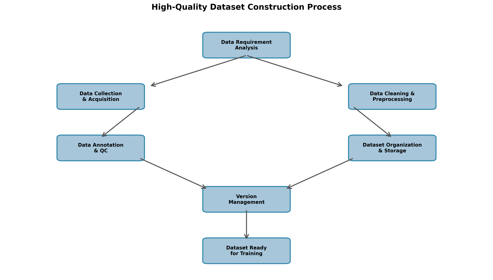

# 高质量数据集建设方案

---

**版本**: 1.0  
**日期**: 2025-12-02  
**作者**: Manus AI

---

## 1. 概述

### 1.1. 背景

高质量的数据集是训练高性能领域大模型的基石。在人工智能技术的驱动下，数据的质量直接决定了模型的能力上限。为了构建一个在特定领域（如核电、能源）具备专业知识和解决复杂问题能力的领域大模型，必须建立一套系统化、标准化、可持续的高质量数据集建设方案。

### 1.2. 目标

本方案旨在为高质量数据集的建设提供一套完整的方法论和实施路径，确保数据集在**规模、多样性、准确性、合规性**等方面达到业界领先水平。具体目标包括：

- **建立统一的数据采集与整合流程**：整合多源异构数据，形成统一的数据资源池。
- **制定严格的数据清洗与预处理标准**：提升数据质量，降低噪声数据对模型训练的干扰。
- **实施高效的数据标注与质检体系**：确保标注数据的准确性和一致性。
- **构建科学的数据集版本管理与追溯机制**：保障数据集的迭代更新和可追溯性。

### 1.3. 范围

本方案适用于领域大模型训练所需的全类型数据集建设，包括但不限于：

- **文本数据**：技术文档、研究报告、操作手册、规章制度、新闻资讯等。
- **代码数据**：各类编程语言的开源代码、脚本、配置文件等。
- **图像数据**：设备图片、流程图、图纸、监控影像等。
- **音视频数据**：专家讲座、操作录像、语音指令等。

---

## 2. 数据集建设流程

高质量数据集的建设遵循一个系统化的生命周期管理流程，如下图所示：

*图1：高质量数据集建设流程* 

### 2.1. 数据需求分析

在数据集建设的初期，首先要明确模型训练的具体需求，包括：

- **模型能力目标**：模型需要具备哪些核心能力？（如：知识问答、代码生成、报告撰写）
- **应用场景**：模型将在哪些具体场景下应用？（如：智能运维、安全巡检、培训考核）
- **数据类型需求**：需要哪些类型的数据来支撑模型能力的训练？

### 2.2. 数据采集与获取

根据数据需求，从多个渠道采集和获取数据。

| 数据来源 | 数据类型 | 采集方式 | 采集工具/技术 |
|---|---|---|---|
| **内部数据** | 技术文档、操作手册、规章制度 | 数据库抽取、文件系统扫描 | ETL工具、文件同步工具 |
| **外部数据** | 开源论文、技术博客、行业报告 | 网络爬虫、API接口 | Scrapy、BeautifulSoup、API SDK |
| **合成数据** | 对话数据、代码示例、特定场景图像 | 数据生成算法、GAN | 自主研发、开源模型 |
| **合作数据** | 合作伙伴提供的专业数据 | 安全文件传输、API接口 | SFTP、HTTPS |

### 2.3. 数据清洗与预处理

原始数据通常包含大量噪声和不规范内容，需要进行严格的清洗和预处理。

#### 2.3.1. 文本数据清洗

- **格式统一**：将PDF、DOCX、HTML等格式统一转换为纯文本或Markdown格式。
- **去重处理**：基于内容相似度（如SimHash）去除重复或高度相似的文本。
- **噪声过滤**：去除无关信息，如广告、导航栏、页眉页脚等。
- **隐私脱敏**：识别并脱敏个人身份信息、联系方式等敏感数据。

#### 2.3.2. 图像数据预处理

- **格式转换**：统一图像格式为JPEG或PNG。
- **尺寸归一化**：将图像尺寸调整为模型训练所需的标准尺寸。
- **数据增强**：通过旋转、裁剪、调整亮度和对比度等方式扩充数据集。

### 2.4. 数据标注与质检

高质量的标注是发挥数据价值的关键环节。详细内容请参考《基于人工智能技术的数据集标注标准》。

### 2.5. 数据集组织与存储

- **目录结构**：按照“领域/主题/数据类型”的层次化结构组织数据集。
- **存储方案**：采用对象存储（如S3）或分布式文件系统（如HDFS）进行存储，确保高可用和可扩展性。
- **元数据管理**：为每个数据集建立详细的元数据，包括数据来源、采集时间、标注信息、版本号等。

### 2.6. 数据集版本管理

采用类似Git的版本控制机制管理数据集，推荐使用**DVC (Data Version Control)**工具，实现：

- **版本追溯**：记录每次数据集的变更，方便回溯和复现。
- **分支管理**：支持不同实验并行使用不同版本的数据集。
- **存储优化**：通过数据去重和增量存储，降低存储成本。

---

## 3. 关键技术与工具

| 环节 | 关键技术 | 推荐工具 |
|---|---|---|
| **数据采集** | 网络爬虫、API集成 | Scrapy、Requests、BeautifulSoup |
| **数据清洗** | 正则表达式、NLP预处理 | Pandas、NLTK、spaCy |
| **数据去重** | SimHash、MinHash | 自主研发、text-dedup |
| **数据标注** | AI辅助标注、主动学习 | Label Studio、CVAT、SuperAnnotate |
| **版本管理** | 数据版本控制 | DVC、Git LFS |
| **存储** | 对象存储、分布式文件系统 | AWS S3、MinIO、HDFS |

---

## 4. 组织与保障

### 4.1. 团队角色与职责

- **数据工程师**：负责数据采集、清洗、存储和版本管理。
- **数据标注专家**：负责制定标注规范、培训标注团队、质检标注结果。
- **领域专家**：提供专业知识支持，审核数据质量和标注准确性。
- **项目经理**：负责项目计划、资源协调、进度跟踪。

### 4.2. 质量保障

- **建立数据质量评估体系**：从准确性、完整性、一致性、时效性等维度评估数据质量。
- **实施多轮质检流程**：标注员自检、交叉互检、专家抽检。
- **建立问题反馈与迭代机制**：及时发现和修复数据问题，持续提升数据质量。

### 4.3. 安全合规

- **遵守数据隐私法规**：严格遵守GDPR、CCPA等国内外数据隐私保护法规。
- **实施数据脱敏**：对个人身份信息、商业机密等敏感数据进行脱敏处理。
- **建立数据访问控制**：根据角色和权限控制数据的访问和使用。

---

## 5. 附录

### 5.1. 参考文献

[1] Google. "Data Collection for Large Language Models." Google AI Blog. 2023.
[2] OpenAI. "Best Practices for Dataset Creation." OpenAI Blog. 2024.
[3] DVC. "Data Version Control: A Git for Data." https://dvc.org/

### 5.2. 术语解释

- **ETL**: Extract, Transform, Load（抽取、转换、加载）
- **SimHash**: 一种用于文本去重的局部敏感哈希算法。
- **DVC**: Data Version Control，一个开源的数据版本控制工具。
