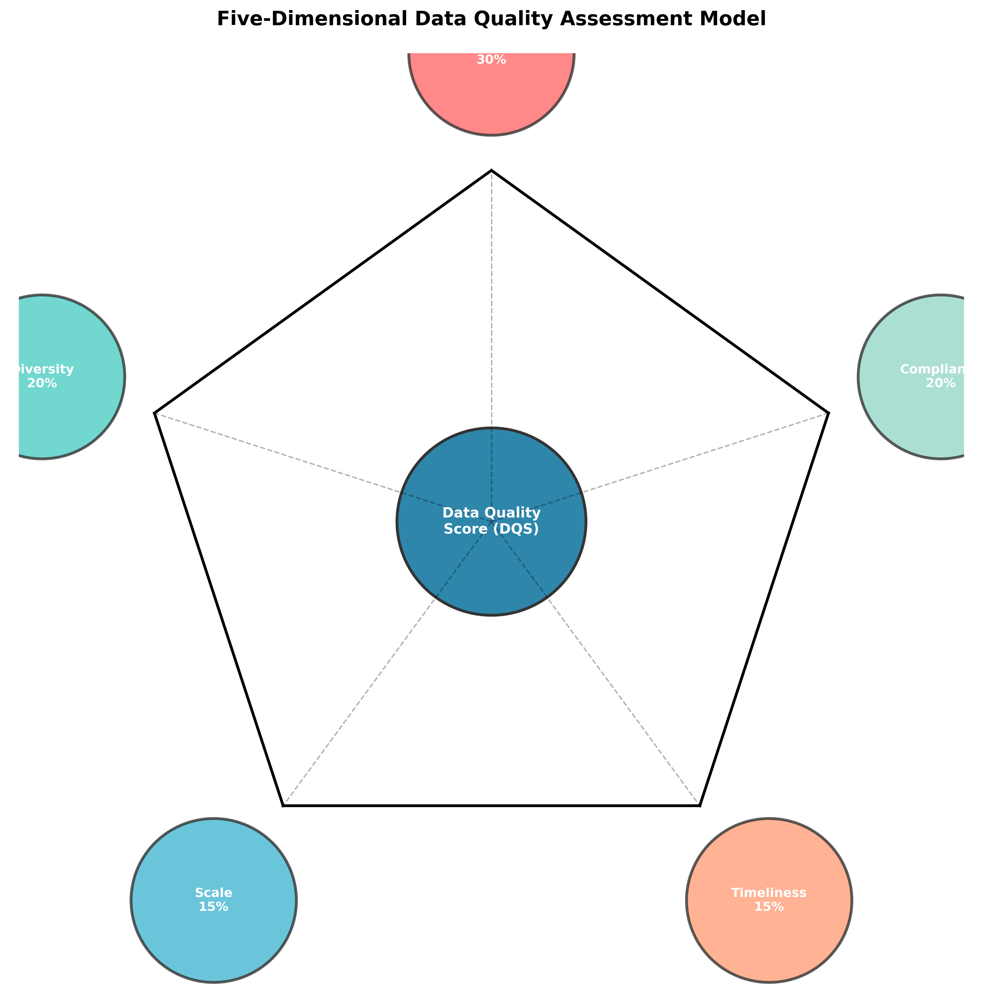

# CGN高质量数据集评价体系设计方案

---

**版本**: 1.0  
**日期**: 2025-12-02  

---

## 1. 概述

### 1.1. 背景

数据集是驱动领域大模型能力的核心燃料，其质量直接决定了模型性能的天花板。为了系统性地量化和提升用于CGN领域大模型训练的数据集质量，建立一套科学、全面、可操作的数据集评价体系至关重要。本方案旨在提供一个标准化的框架，用于评估和度量数据集的质量，从而指导数据采集、清洗、标注和应用的全过程。

### 1.2. 目标

本评价体系的核心目标是**实现数据集质量的可度量、可追溯、可提升**。具体目标包括：

- **建立多维度评价模型**：从数据的内在质量、业务价值和应用效能等多个维度，构建全面的评价指标体系。
- **实现评价过程标准化**：定义标准的评价流程、方法和工具，确保评价结果的客观性和一致性。
- **驱动数据质量持续优化**：通过评价反馈，识别数据质量瓶颈，指导数据治理和数据集建设的持续改进。
- **赋能数据资产价值评估**：为数据集的价值评估、成本核算和流通交易提供量化依据。

### 1.3. 评价对象

本体系适用于CGN为训练领域大模型而构建的各类数据集，包括：

- **预训练数据集**：用于模型基础能力训练的大规模、通用性语料库。
- **微调数据集**：用于模型领域知识注入和任务能力对齐的指令微调（SFT）数据集、偏好数据集（RM）等。
- **评测数据集**：用于评估模型在特定领域、特定任务上表现的标准化测试集。

---

## 2. 评价维度与指标体系

数据集质量评价体系（Data Quality Assessment, DQA）围绕**五大维度**展开，共包含**18个核心指标**。每个维度和指标都赋予了相应的权重，以构成最终的数据集质量综合评分（Data Quality Score, DQS）。

*图1：数据集质量评价五维模型*

### 2.1. 评价指标详情

| 评价维度 (权重) | 核心指标 (权重) | 指标定义 | 评价方法 | 自动化可行性 |
|---|---|---|---|---|
| **准确性 (30%)** | **事实正确率 (10%)** | 数据中包含的事实性信息与公认知识或领域事实的符合程度。 | 专家审核、交叉验证、事实核查API | 中 |
| | **标注准确率 (15%)** | 标注结果与真实标签（Ground Truth）的一致性。 | 抽样质检、一致性校验（Kappa系数） | 高 |
| | **格式规范性 (5%)** | 数据格式是否符合预定义的标准（如JSON Schema、语法规则）。 | 格式校验脚本、Linter工具 | 高 |
| **多样性 (20%)** | **主题覆盖度 (8%)** | 数据集覆盖的领域主题、子主题的广度。 | 主题模型（LDA）、关键词提取、与领域知识图谱比对 | 高 |
| | **场景多样性 (7%)** | 数据覆盖的应用场景、任务类型的丰富程度。 | 场景分类模型、人工审核 | 中 |
| | **表达多样性 (5%)** | 同一语义在不同表达方式（句式、措辞）上的丰富程度。 | 句法分析、文本相似度计算 | 高 |
| **规模性 (15%)** | **样本数量 (8%)** | 数据集中包含的独立样本（文档、图片、对话）的总量。 | 统计计数 | 高 |
| | **Token数量 (7%)** | 数据集中包含的总Token数（适用于文本数据）。 | Tokenizer分词统计 | 高 |
| **时效性 (15%)** | **数据时新性 (10%)** | 数据内容反映的是否为近期或当前的信息和知识。 | 时间戳提取、事件时效性判断 | 中 |
| | **更新频率 (5%)** | 数据集的更新和维护周期。 | 版本记录查询 | 高 |
| **合规性 (20%)** | **隐私合规性 (8%)** | 数据是否包含个人身份信息（PII）或其他敏感信息。 | 隐私数据扫描工具（如Presidio）、正则表达式 | 高 |
| | **偏见与公平性 (7%)** | 数据在不同群体（性别、地域等）之间是否存在偏见或歧视性内容。 | 偏见检测模型（如Aequitas）、词嵌入关联测试 | 中 |
| | **版权合规性 (5%)** | 数据来源是否合法，是否存在版权纠纷风险。 | 来源审计、版权声明检查 | 低 |

---

## 3. 评价流程

数据集评价流程遵循PDCA（Plan-Do-Check-Act）循环，确保评价工作的规范性和持续性。

1.  **P (Plan) - 评价规划**
    - **确定评价目标**：明确本次评价的目的（如：数据集入库审核、模型训练前评估）。
    - **选择评价指标**：根据数据集类型和评价目标，从指标体系中选择适用的指标和权重。
    - **制定评价计划**：明确评价时间、参与人员、所需资源和交付成果。

2.  **D (Do) - 执行评价**
    - **自动化评估**：运行自动化脚本和工具，计算可自动评估的指标得分。
    - **人工抽样评估**：根据统计学原理进行抽样，由领域专家和数据分析师对需要人工审核的指标进行打分。
    - **数据汇总**：收集所有指标的评分，准备进行综合计算。

3.  **C (Check) - 分析与报告**
    - **计算综合得分**：根据各维度和指标的权重，加权计算数据集的质量综合评分（DQS）。
    - **生成评价报告**：报告内容应包括综合得分、各维度得分、问题分析、改进建议等。
    - **结果审核**：由数据治理委员会对评价报告进行审核和确认。

4.  **A (Act) - 处置与改进**
    - **数据定级**：根据DQS将数据集评定为不同等级（如：精品、合格、待优化）。
    - **问题处置**：将评价中发现的问题录入问题跟踪系统，分配给相关团队进行修复。
    - **流程优化**：根据评价结果，反思并优化数据集建设和评价流程本身。

---

## 4. 数据集质量等级

根据数据质量综合评分（DQS），将数据集划分为四个等级：

| 等级 | DQS分数范围 | 描述 | 建议应用场景 |
|---|---|---|---|
| **S (精品)** | 90 - 100 | 质量极高，各维度表现优异，可作为行业标杆。 | 核心模型预训练、关键任务微调、模型能力评测基准。 |
| **A (优良)** | 75 - 89 | 质量良好，满足绝大多数应用需求，仅有少量非关键性问题。 | 通用模型预训练、常规任务微调。 |
| **B (合格)** | 60 - 74 | 质量基本合格，存在一些明显问题，需在应用前进行针对性处理。 | 辅助性任务微调、模型研究性实验。 |
| **C (待优化)** | < 60 | 质量较差，存在严重缺陷，不建议直接用于模型训练。 | 返回数据清洗或重新标注环节，或仅用于负样本挖掘。 |

---

## 5. 组织与保障

- **数据治理委员会**：作为最高决策机构，负责审批评价体系、审核重大评价结果、仲裁争议。
- **数据质量管理团队**：作为执行机构，负责评价体系的日常运维、组织实施评价工作、撰写评价报告。
- **领域专家组**：提供专业知识支持，参与人工评估和结果审核。
- **工具平台支持**：开发和维护自动化评价工具，提升评价效率和准确性。

---

## 6. 附录

### 6.1. 参考文献

[1] DAMA International. *DAMA-DMBOK: Data Management Body of Knowledge (2nd Edition)*. 2017.
[2] National Institute of Standards and Technology (NIST). *Towards a Standard for Identifying and Managing Bias in Artificial Intelligence*. 2022.
[3] Google. *Data Quality: The Foundation for Trustworthy AI*. 2023.
